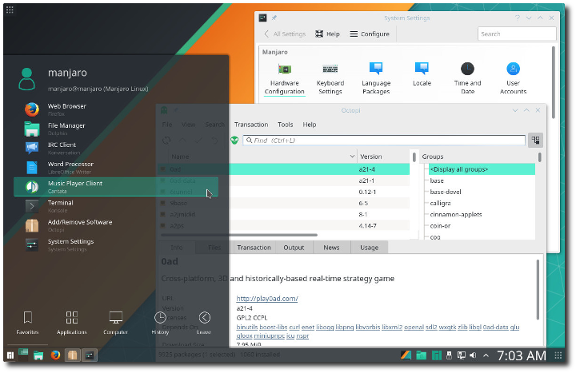
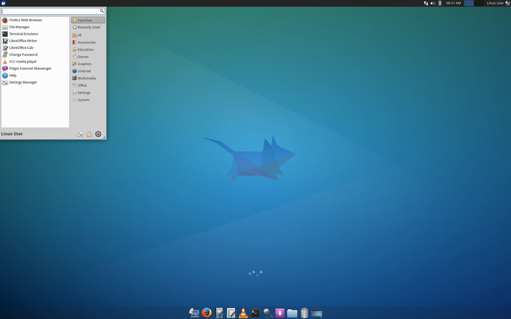
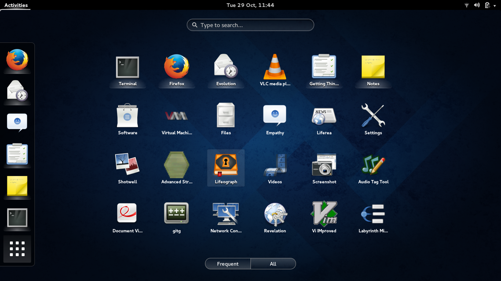
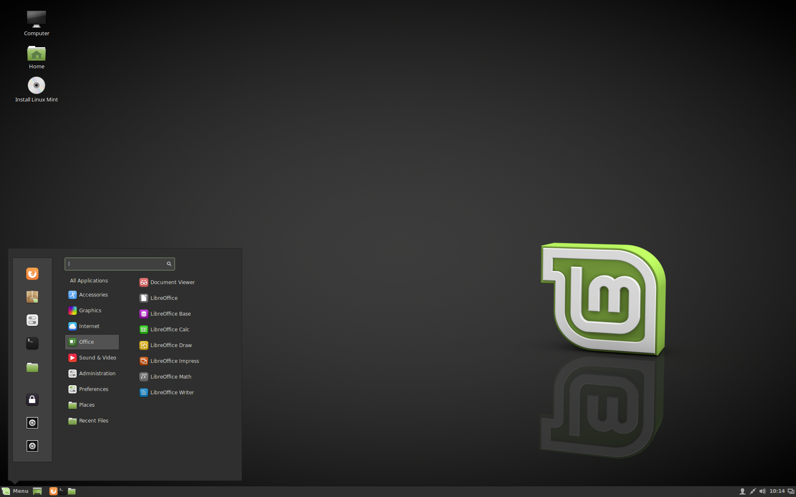

# Wybór dystrybucji i środowiska graficznego

## Informacje wstępne

Aby móc rozpocząć swoją przygodę z Linuksem, musisz podjąć najpierw dosyć trudną dla początkującego decyzję. Mianowicie - musisz wybrać dystrybucję i środowisko graficzne.

Pojęcie dystrybucji poznałeś we wprowadzeniu do książki. Czym natomiast jest środowisko graficzne? Najprościej mówiąc, to po prostu element systemu operacyjnego, umożliwiający wykonywanie w trybie graficznym podstawowych zadań: uruchamianie i korzystanie z programów, konfiguracja systemu. Czym dwa różne środowiska różnią się między sobą? Chyba najbardziej zauważalną różnicą jest ich wygląd, inne są też ich możliwości konfiguracji, zapotrzebowanie na zasoby. Żeby lepiej Ci to wszystko zobrazować, posłużymy się przykładowymi zrzutami ekranu.

KDE

XFCE

GNOME

Cinnamon

## Czym kierować się przy wyborze dystrybucji i środowiska graficznego?

Niestety, chyba nie istnieje dystrybucja idealna - gdyby tak było, istniałaby pewnie tylko ona, bo cała reszta byłaby nikomu niepotrzebna. Każda dystrybucja posiada swoje zalety, wady i cechy. Jedne są przystosowane do użytku na komputerach osobistych (Linux Mint, Manjaro, Ubuntu), inne będą stosowane głównie na serwerach (CentOS, Ubuntu Server). Jeszcze inne stanowią zbiór narzędzi, przykładowo do pentestingu (Kali Linux).

Istnieją dystrybucje bardzo stabilne (niestety kosztem starszych pakietów) oraz mniej stabilne, które wynagradzają tę wadę bardziej aktualnymi pakietami oprogramowania.

Część dystrybucji jest przystosowana do obsługi przez osoby początkujące i bardzo przyjazna dla takich osób. Przykładem jest choćby, wspominany już wcześniej, Linux Mint. Inne, takie jak Arch Linux, czy Gentoo, wymagają obeznania i doświadczenia ze strony użytkownika.

Różne dystrybucje różnią się także środowiskami graficznymi i dołączanymi do dystrybucji programami codziennego użytku. Mint Cinnamon używa środowiska... Cinnamon, Xubuntu - XFCE, Lubuntu - LXDE. Cinnamon, z tego co nam wiadomo, używa domyślnie menedżera plików Nemo, KDE - Dolphin i tak dalej.

A więc czym kierować się przy wyborze środowiska graficznego? Głównie jest to kwestia upodobań (różne środowiska graficzne często różnią się wyglądem), przyzwyczajenia. Należy też jednak pamiętać, że niektóre środowiska będą zużywały więcej zasobów niż inne. Toteż nie należy na 15 letnim komputerze instalować pełnego rozmaitych efektów KDE, czy GNOME.

## Jak odnaleźć się w tak dużej ilości dystrybucji?

Dla osoby początkującej, wybór dystrybucji jest stosunkowo trudną decyzją. Dlaczego? Świat Linuksa pełen jest różnych najrozmaitszych systemów: Ubuntu, Linux Mint, Manjaro, Fedora, Debian... Większość z nich posiada kilka wersji z różnymi środowiskami graficznymi: Mint Cinnamon, Mint KDE, Manjaro XFCE, KDE...

Do tego, niejednokrotnie zdarza się tak, że jedna osoba poleca daną dystrybucję, jednocześnie odradzając inną, a druga osoba robi dokładnie odwrotnie.

Jak więc Ty, osoba zapewne początkująca, może odnaleźć się w tym pozornym bałaganie? Postanowiliśmy nieco uprościć Ci życie i dokonać tego wyboru za Ciebie. Postawiliśmy na Linux Mint ze środowiskiem Cinnamon. Dlaczego?

- Jest to w chwili obecnej chyba najpopularniejsza dystrybucja, co będzie wiązało się z dość dużym wsparciem ze strony społeczności
- Mint jest dość prosty w obsłudze, powinien więc być dobrą dystrybucją na start
- Środowisko Cinnamon jest dość przejrzyste i przyjazne, zapoznanie się z nim nie powinno stanowić kłopotu

Czy możesz zdecydować się na inną dystrybucję i inną powłokę? Pewnie, niczego Ci nie narzucamy. Pamiętaj jednak, że mogą występować pewne różnice pomiędzy stosowanym przez nas oprogramowaniem, a tym wybranym przez Ciebie. Może to więc nieco utrudnić korzystanie z tej książki.

Jeśli jesteś osobą początkującą, stanowczo odradzamy Ci instalowanie systemów takich jak Gentoo, czy Arch Linux. Wymagają one dość sporej wiedzy od użytkownika i można się bardzo szybko zniechęcić.

Nie polecamy też Ci instalowania dystrybucji takich jak Kali Linux. Dlaczego? Odpowiedź na to pytanie znajdziesz [w tym artykule](http://kot-zrodlowy.pl/linux/dajsiepoznac2017/2017/02/04/nie-chcesz-instalowac-kali.html).